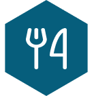
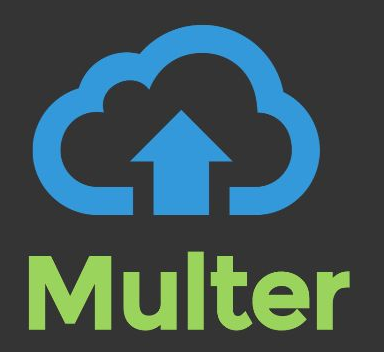

  

<h4 align="center"> 
	 Status: Under development.
</h4>

 

# Food Explorer

 

**Rocketseat's Explorer program ultimate challenge API.** 

---

	<a href="#about">About</a> •
  <a href="#preview">Preview</a> •
	<a href="#tech-stack-and-tools">Tech Stack and tools</a> •
  <a href="#functionalities">Functionalities</a> •
	<a href="#publication">Publication</a> •
	<a href="#author">Author</a> 

---

## About

> An API that helps at restaurant managing through an interactive menu.

Project developed as a result of the teachings learned at Rocketseat's program Explorer, a FullStack developer formation.

A Backend API using JavaScript and NodeJS that allows you to sign up and sign in as a default user as well as sign in as administrator.

As the first persona you will be able to edit your profile, see all the registered dishes, add them to favorites, checking and editing this list after, see it details by clicking them, add as many itens as you want to the shopping cart, see your current and previous orders and do the checkout.

As the second persona you will be able to create, see /read, edit and delete (CRUD) any dishes at any time, add them to favorites, checking and edit this list after, see and control all and each one of the requests and its , as well as see all the users and assign them to administrator role as needed and wanted.

## Preview

## Tech Stack and tools

 
	
	
	
	
	
	
	
	
		
		

## Functionalities

- Register users;
- Update user name, email, password, and avatar

